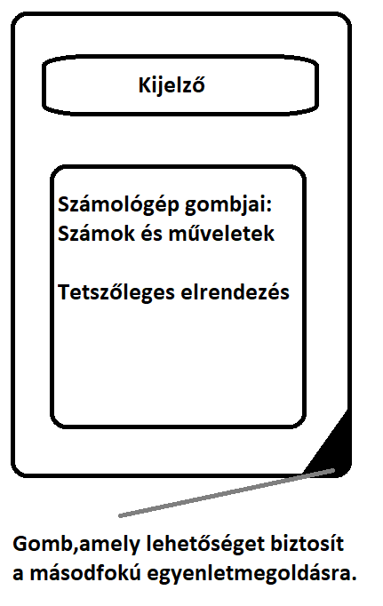

# Funkcionális Specifikáció

## 1. Áttekintés
A projekt célja,hogy a vállalat dolgozói egy saját,egyedi számológépet használva végezhessék el a munkájukhoz kapcsolódó matematikai számításokat. A számológépnek egyszerűnek, és könnyen használhatónak kell lennie. Az alkalmazás funkciói: Összeadás, kivonás, szorzás, osztás, hatványozás, gyökvonás, a hagyományos számológépen látható DEL illetve AC jelzésű gombok, valamint külön felület,amely másodfokú egyenlet megoldására képes.

## 2. Használati esetek
A rendszer használói a következők:
*	A Megrendelő Vállalat dolgozói
A rendszernek a következő funkciókat kell ellátnia:
*	2,vagy több szám összegének kiszámítása.
*	2,vagy több szám különbségének kiszámítása.
*	2,vagy több szám szorzatának kiszámítása.
*	2,vagy több szám hányadosának kiszámítása.
*	Számok négyzetre emelése,hatványozása.
*	Számok négyzetgyökének, valamint köbgyökének kiszámítása.
*	A Fent említett műveletek együttes használata.
*   Felület,mely másodfokú egyenlet megoldására képes.

## 3. Megfeleltetés, hogyan fedik le a használati esetek a követelményeket
*   K01: Az alkalmazás úgy hozzuk létre, hogy kizárólag a vállalat dolgozói férjenek hozzá a programhoz.

## 4. Képernyőtervek

## 5. Forgatókönyvek
Program megnyitása után megjelenik a képernyőterven látott felület, az alatta futó programkód pedig lehetővé teszi a számológép funkcióinak hibamentes ellátását.
A másodfokú egyenletek megoldását lehetővé tevő funkciót a jobb alsó sarokban található gombra kattintva érjük el.

## 6. Funkció–követelmény megfeleltetés

ID|Verzió|Követelmény|Funkció
--|------|---|--------
K01|V1.0|Csak dolgozó használhatja| WIP