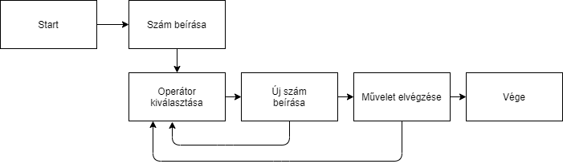

## 1. Rendszer célja

A projekt célja,hogy a vállalat dolgozói egy saját,egyedi számológépet használva végezhessék el a munkájukhoz kapcsolódó matematikai számításokat. A számológépnek egyszerűnek, és könnyen használhatónak kell lennie. Az alkalmazás funkciói: Összeadás, kivonás, szorzás, osztás, hatványozás, gyökvonás, a hagyományos számológépen látható DEL illetve AC jelzésű gombok, valamint külön felület,amely másodfokú egyenlet megoldására képes.
 
## 2. Projektterv

## 3. Üzleti folyamatok modellje

## 4. Követelmények

* Funkcionális
    - Egyszerűbb matematikai műveletek elvégzése
    - A folyamat alatt az eredmények tárolása
    - Megakadályozni, hogy a felhasználó érvénytelen adatot adjon meg
	- Másodfokú egyenlet megoldására legyen képes

### Nem Funkcionális 
    - Gyorsnak és átláthatónak kell lennie
	- Úgy érezze a felhasználó mintha gyorsabb fejben vagy papíron való számolás helyett a műveletek megoldása.
	- Úgy nézzen ki a program mintha nem 15 éve fejlesztették volna amikor csak szögletes kis windows programok voltak. 

## 5. Funkcionális terv

* Rendszerszereplő:
    - Felhasználó(dolgozó)

### Rendszerhasználati esetek:
* Felhasználó tudjon a programmal:
    - Összeadni
    - Kivonnni
	- Osztani
    - Szorozni
    - Számokat begépelni
	- Kijelző törlésére és beírt reláció javítására/törlésére
	- Képes legyen másodfokú egyenletet megoldani

### Menü-hierarchia:
* Interface:
	- Kijelző megjelenítése mely a jelenlegi eredményt mutatja
	- Gombok melyek a reláció beírásához szükségesek(Számok 0-9, operátorok)
	- Gomb mellyel ki lehet terjeszteni az ablakot ahol a másodfokú egyenlet megoldó található
	- Gombok a program kezelésére(tálcára rakás, bezárás)
	- Gomb a kijelző megjelenítésére

## 6. Fizikai környezet

* Fejlesztői környezet:
    - JavaFX
    - Git
    - Notepad++
	- Visual Studio Code
	- IntelliJ IDEA

## 7. Architekturális terv

Az alkalmazás a dolgozó gépén fog futni java futtató program segítségével 

* Specifikáció:
    - Szükséges egy számítógép megfelelő specifikációjú számítógép
	- Szükség hogy a számítógépen rajta legyen megfelelő futtató program (java 8) 

## 8. Adatbázis terv

Az alkalmazásunkhoz nincs szükség adatbázisra, azonban előfordulhat, hogy tárolni kell helyi fájlokat, ebben az esetben a felhasználó számítógépén történik a tárolás.

## 9. Implementációs terv

Az alkalmazás a felhasználó gépén fog futni java segítségével.
Valamint a részeredmények és az előző eredmények a felhasználó rendszerének tárhelyén fog helyi fájlként tárolásra kerülni.

## 10. Tesztterv

A rendszerterv szerint implementált szoftver tesztelésének célja az Üzleti folyamatok modellje című pontban meghatározott folyamatok helyes, gördülékeny lefutása.

A tesztelés során használt kliens hardverek a napjainkban általánosan elterjedt hardverkonfigurációjú PC-k illetve laptopok.
A minimum hardverkonfiguráció: Intel Celeron processzor, 4GB RAM, 128GB HDD, a képernyők felbontása 
1280x1024 vagy 1920x1080 valamint telepített java 8-as verzió

A tesztelés során a szoftver megfelelő működését vizsgáljuk. Amennyiben az elvártnak megfelelő 
eredményt kapunk, a teszt eset sikeresnek tekinthető, ellenkező esetben a hibát rögzítjük a teszt jegyzőkönyvben. Ezt követően a megtalált
hibákat javítjuk a szoftverben, és újbóli tesztelésnek vetjük alá a rendszert.

## 11. Telepítési terv

* Fizikai telepítési terv: 
    - Szükség van a megfelelő specifikációs számítógépre.  
* Szoftver telepítési terv: 
    - A java telepítése után telepíthető az alkalmazás

## 12. Karbantartási terv

Az alkalmazásnak nincs szüksége különösebb karbantartásra, új funkció hozzáadása esetén opcionális frissítést teszünk elérhetővé a felhasználó számára.
